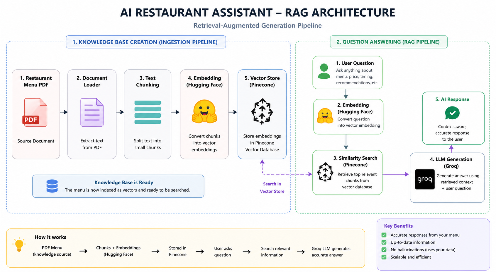
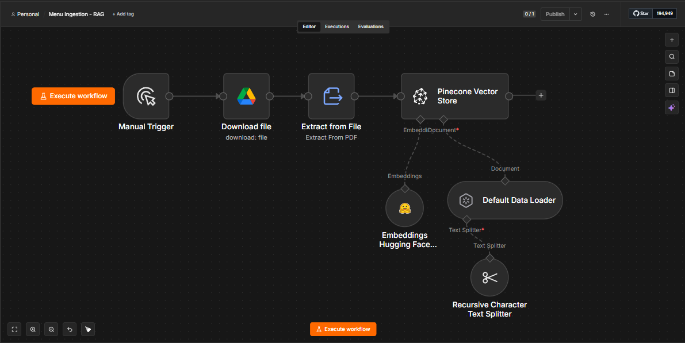
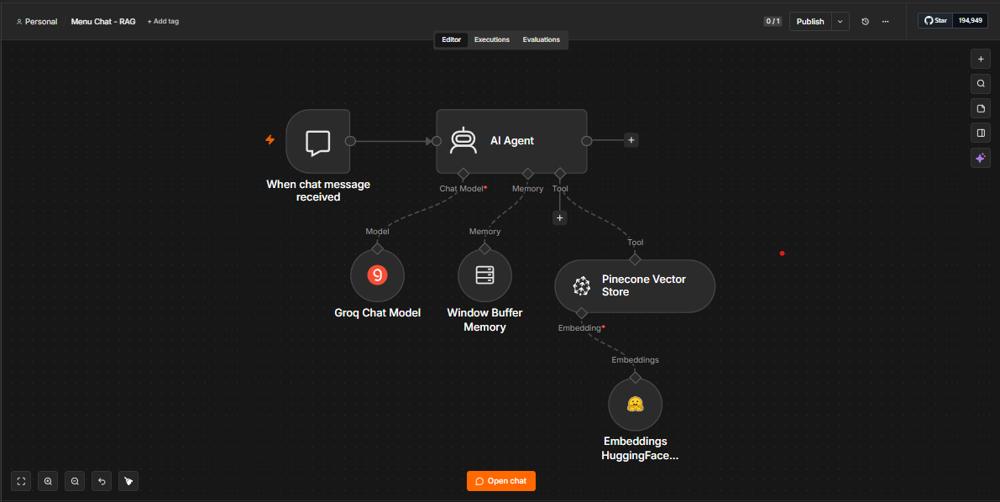
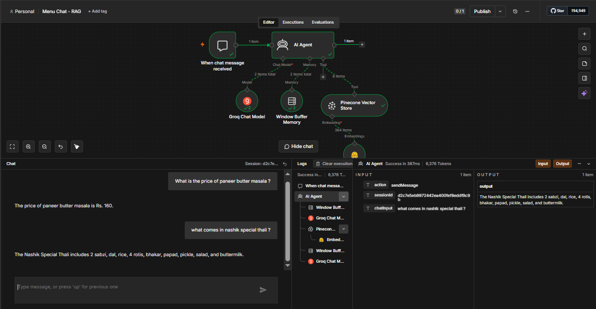

<div align="center">

# 🍽️ AI Restaurant Assistant using RAG

### 🤖 AI-powered Restaurant Assistant built with Retrieval-Augmented Generation (RAG)

Answer restaurant-related questions naturally using a restaurant menu PDF powered by AI.

<br>


<br><br>

<p>
An AI-powered Restaurant Assistant that answers customer questions directly from a restaurant menu PDF using semantic search, vector embeddings, and a Large Language Model.
</p>

</div>

---

## 📖 Overview

I built this project to understand how **Retrieval-Augmented Generation (RAG)** works in practice by creating an AI-powered restaurant assistant.

Instead of using hardcoded responses, the assistant retrieves relevant information from a restaurant menu PDF and generates accurate, context-aware answers using a Large Language Model (LLM).

The complete workflow is built in **n8n**, where the restaurant menu is processed into embeddings using Hugging Face, stored in Pinecone, and retrieved whenever a user asks a question. The retrieved context is then passed to Groq to generate a natural response.

This project helped me gain practical experience with document chunking, embeddings, vector databases, semantic search, and LLM integration.

---

## ✨ Features

- 🤖 AI-powered Restaurant Assistant
- 📄 Uses a restaurant menu PDF as the knowledge base
- 💬 Answers natural language questions
- 🍛 Recommends dishes from the menu
- 💰 Provides menu pricing information
- 🕒 Shares restaurant timings
- 🥗 Suggests vegetarian and Jain food options
- ⚡ Built using n8n automation workflows
- 🧠 Uses semantic search with vector embeddings
- 📚 Generates context-aware responses using RAG

---

## 🛠️ Tech Stack

| Technology | Purpose |
|------------|---------|
| n8n | Workflow Automation |
| Groq | Large Language Model |
| Hugging Face | Embedding Generation |
| Pinecone | Vector Database |
| RAG | Retrieval-Augmented Generation |
| PDF | Restaurant Knowledge Base |


---

## 🏗️ System Architecture

The AI Restaurant Assistant follows a Retrieval-Augmented Generation (RAG) pipeline to provide accurate and context-aware responses.

<p align="center">
  
</p>


```
Restaurant Menu PDF
        │
        ▼
Document Loader
        │
        ▼
Text Chunking
        │
        ▼
Hugging Face Embeddings
        │
        ▼
Pinecone Vector Database
        │
        ▼
User Question
        │
        ▼
Similarity Search
        │
        ▼
Groq LLM
        │
        ▼
AI Response
```

### Architecture Explanation

- **Restaurant Menu PDF** serves as the knowledge source.
- The document is loaded and split into smaller chunks.
- Hugging Face converts each chunk into vector embeddings.
- Pinecone stores the embeddings for semantic search.
- When a user asks a question, the same embedding model converts the query into a vector.
- Pinecone retrieves the most relevant document chunks.
- Groq receives both the retrieved context and the user's question.
- The LLM generates a natural and context-aware response.


---

## ⚙️ Project Workflow

The project consists of two workflows built in n8n.

### Workflow 1 — Knowledge Base Creation

- Load the restaurant menu PDF.
- Extract the document content.
- Split the content into smaller chunks.
- Generate embeddings using Hugging Face.
- Store embeddings in Pinecone.

### Workflow 2 — AI Chat

- Receive a user's question.
- Convert the question into an embedding.
- Search Pinecone for the most relevant chunks.
- Pass the retrieved context and question to Groq.
- Return the generated response to the user.

This workflow ensures that responses are generated using information from the restaurant menu instead of relying solely on the LLM's general knowledge.


---

## 🎥 Project Demo

A complete walkthrough of the AI Restaurant Assistant is available below.

🔗 **LinkedIn Demo:** https://www.linkedin.com/feed/update/urn:li:activity:7478439960472301569/

The demonstration includes:

- Knowledge base creation using a restaurant menu PDF
- Document chunking and embedding generation
- Vector storage in Pinecone
- Natural language question answering
- Context-aware responses using RAG


---

## 📸 Project Screenshots


### Knowledge Base Creation Workflow

<p align="center">
  
</p>

*Loads the restaurant menu PDF, splits it into chunks, generates embeddings, and stores them in Pinecone.*

### AI Chat Workflow

<p align="center">
  
</p>

*Processes user queries, retrieves relevant context from Pinecone, and generates responses using Groq.*

### Sample Conversation

<p align="center">
  
</p>

*Example of the AI answering restaurant-related questions using the uploaded menu PDF.*

---

## 💬 Example Questions

The assistant can answer questions such as:

- What is the price of Paneer Butter Masala?
- Recommend a good breakfast.
- What are the restaurant timings?
- Do you have Jain food?
- What desserts are available?
- What is included in the Veg Thali?


  ---

## 📚 What I Learned

Building this project helped me gain practical experience with the complete RAG pipeline.

Some of the key concepts I learned include:

- Document chunking strategies
- Embeddings and vector representations
- Semantic search using Pinecone
- Retrieval-Augmented Generation (RAG)
- Workflow automation with n8n
- Integrating LLMs with external knowledge bases
- Debugging embedding dimension mismatches
- Designing context-aware AI assistants


  ---

## 👨‍💻 Author

**Saurabh Patil**

MCA Student | AI Automation & Workflow Enthusiast

- GitHub: https://github.com/saurabhpatil67
- LinkedIn: https://www.linkedin.com/in/saurabh-patil-65b387268


  ---

## 📄 License

This project is licensed under the MIT License.

